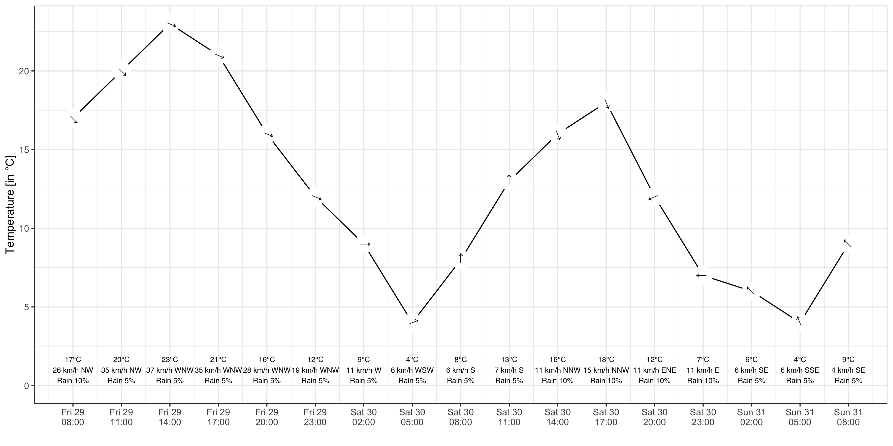
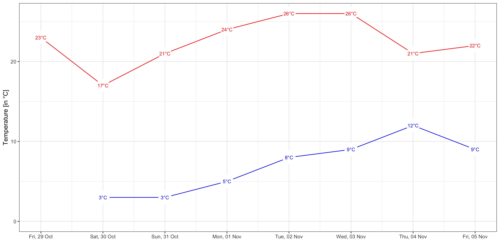
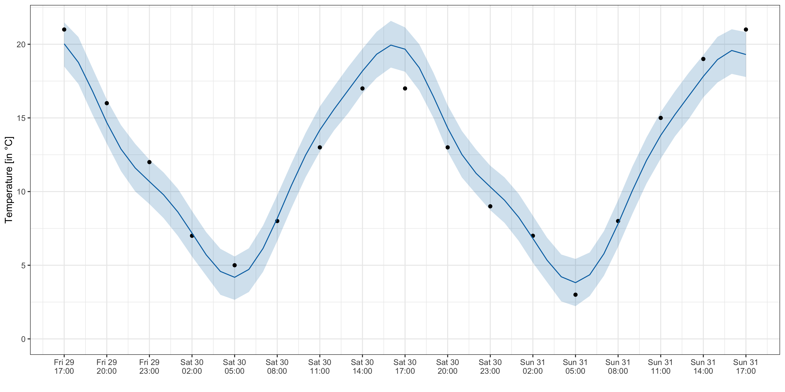

# weatherBOM

This R package provides a few convenience functions to obtain weather data (specifically, daily and 3-hourly forecasts, and current observations) for a specific location from the Australian Government Bureau of Meteorology (BOM) through the BOM's REST API. Sadly, the BOM has recently taken a more restrictive position towards providing data access by means of automated processes. Currently, only limited data are available through the BOM's API endpoint [https://api.weather.bom.gov.au/v1/](https://api.weather.bom.gov.au/v1/). I found the documentation provided in [BoM Weather Docs](https://github.com/trickypr/bom-weather-docs) invaluable for implementing these functions.

## Disclaimer and copyright

This project is neither related to nor endorsed by the BOM. With (continued and expected) changes to how the BOM manages (read: restricts) automatic access to data, some or all of the functions might break at any time. 

All data provided by the BOM are under [copyright](http://reg.bom.gov.au/other/copyright.shtml).


## Installation

The easiest way to install the R package is from GitHub via `remotes`.

```r
remotes::install_github("mevers/weatherBOM")
```

## Examples

We start by loading the library and looking up the location ID for Canberra Airport.

```r
library(weatherBOM)
bom_search_location("Canberra")
```

This returns a `data.frame`

```
  geohash                       id             name postcode state
1 r3dp5hh         Canberra-r3dp5hh         Canberra     2609   ACT
2 r3dp4vp Canberra Airport-r3dp4vp Canberra Airport     2609   ACT
```

from which we can read off the location ID in column `geohash`. For Canberra Airport, this is `r3dp4vp`. 

### 3-hourly forecasts

We can now use the location ID to get 3-hourly forecasts. To make things more interesting, we visualise temperature forecasts and also include labels denoting the predicted wind speed & direction as well as probability of rain.

```r
library(tidyverse)
bom_forecasts("r3dp5hh", "3-hourly") %>%
    mutate(wind.angle = compass2angle(wind.direction)) %>%
    ggplot(aes(time, temp)) +
    geom_line() +
    geom_point(shape = 21, size = 8, colour = "white", fill = "white") +
    geom_text(
        aes(y = 1, label = sprintf(
            "%s°C\n%s km/h %s\nRain %s%%",
            temp, wind.speed_kilometre, wind.direction, rain.chance)),
        size = 2.5, family = "Helvetica") +
    geom_text(aes(angle = 360 - wind.angle), size = 4, label = "↓") +
    labs(x = "", y = "Temperature [in °C]") +
    scale_x_datetime(date_breaks = "3 hour", date_labels = "%a %d\n%H:%M") +
    expand_limits(y = 0) +
    theme_bw()
ggsave("example_3-hourly.png", width = 12, height = 6)
```




### Daily forecasts

To show daily minimum and maximum temperature forecasts we can use `bom_forecasts` with implicit (default) `freq = "daily"`. The following plot shows +7 days maximum and minimum temperatures in red and blue, respectively.


```r
library(tidyverse)
bom_forecasts("r3dp4vp") %>%
    pivot_longer(starts_with("temp_")) %>%
    ggplot(aes(date, value, colour = name)) +
    geom_line() +
    geom_point(shape = 21, size = 10, colour = "white", fill = "white") +
    geom_text(aes(label = sprintf("%s°C", value)), size = 3) +
    scale_color_manual(values = c("red", "blue")) +
    guides(colour = "none") +
    labs(x = "", y = "Temperature [in °C]") +
    scale_x_datetime(date_breaks = "1 day", date_labels = "%a, %d %b") +
    expand_limits(y = 0) +
    theme_minimal()
ggsave("example_daily.png", width = 12, height = 6)
```




## Example - Interpolate between 3-hourly forecasts

As an (educational) exercise, we use [`prophet`](https://facebook.github.io/prophet/) to fit a seasonal model that 3-hourly forecasts and then use the model to obtain hourly "interpolated" values.

```r
library(prophet)
m <- bom_forecasts("r3dp5hh", "3-hourly") %>%
    select(ds = time, y = temp) %>%
    prophet(
        growth = "linear",
        n.changepoints = 0,
        daily.seasonality = TRUE,
        weekly.seasonality = FALSE,
        yearly.seasonality = FALSE)
interpolate <- data.frame(
    ds = seq.POSIXt(min(m$history$ds), max(m$history$ds), by = "1 hour"))
forecast <- predict(m, interpolate)
plot(m, forecast) +
    labs(x = "", y = "Temperature [in °C]") +
    scale_x_datetime(date_breaks = "3 hour", date_labels = "%a %d\n%H:%M") +
    expand_limits(y = 0) +
    theme_bw()
ggsave("example_interpolate.png", width = 12, height = 6)
```


